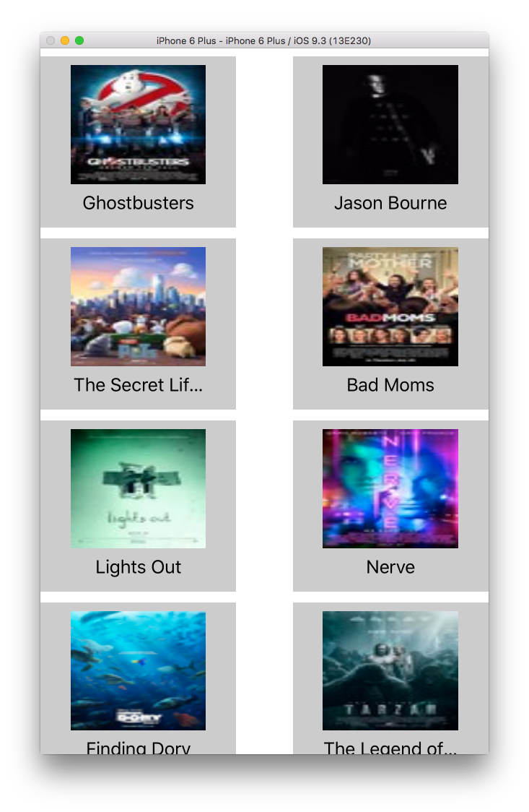
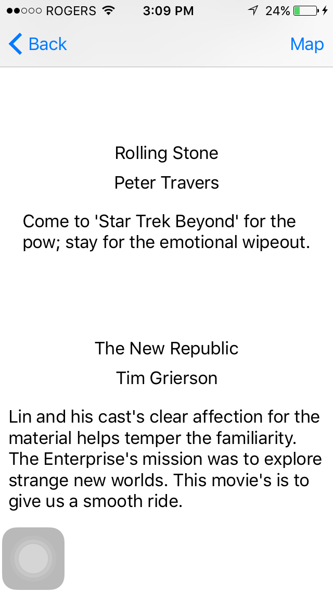
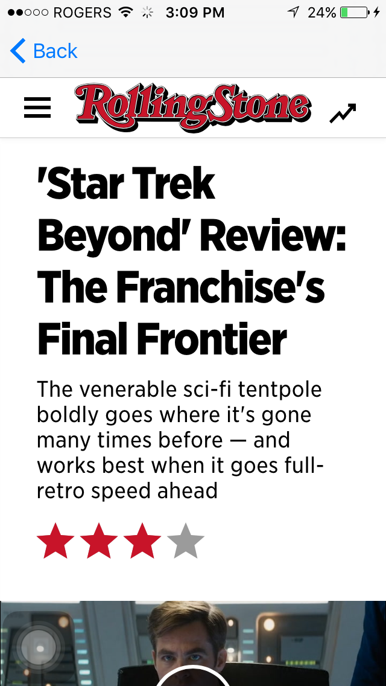
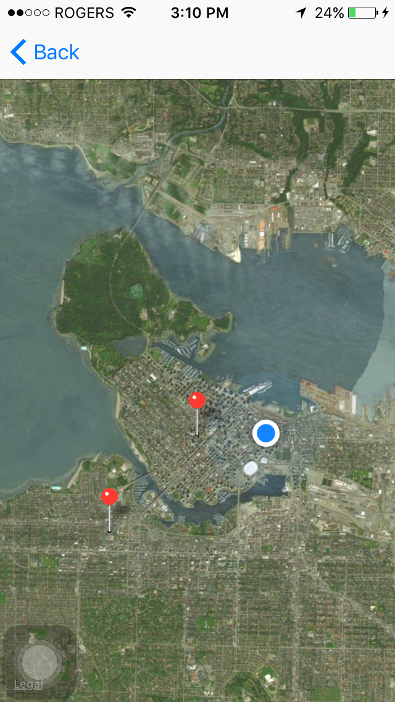

# RottenMangos

## The RottenMangos application is project that I completed at Lighthouse Labs 
The RottenMangos fetches a list of movies that are currently in theaters, and thumbnails images for these images. This information is displayed in a collection view. Users can then see a list of reviews for each movie by clicking on the associated cell. If a user requires more information they can view the full text of the review in a webView by selecting one of these reviews from this list. Finally, by tapping on the barbutton icon at the top of the list of reviews, the user is brought to a map displaying the users current location, and annotations indicating local theaters where the selected movie is playing. 

## This app demonstrates the use of:
1. TableViews
2. CollectionViews
3. MapKit
4. Corelocation framework
5. Interfacing with the Rottentomatoes api
6. WebViews
7. Networking using apples native networking classes
8. parsing and deserializing json data

